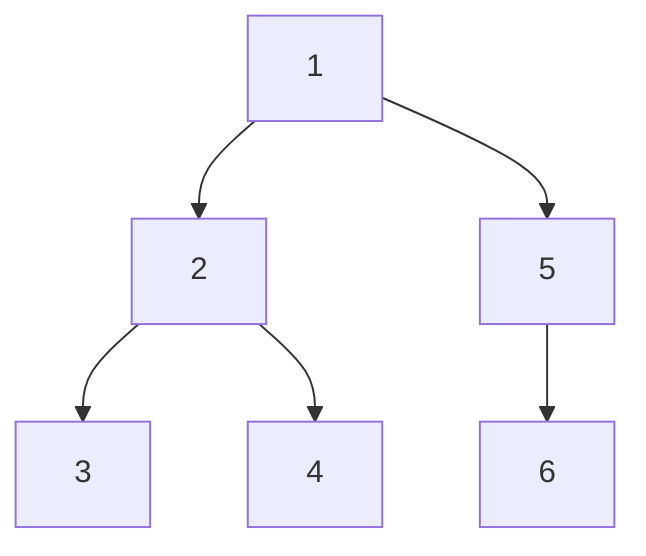

# 二叉树遍历算法

[toc]

## 思路

- 前序遍历（root, left, right）

递归、非递归

- 中序遍历（left, root, right）

递归、非递归

- 后序遍历（left, right, root）

递归、非递归

- 层序遍历

非递归

## 实验

采用前序遍历的方法生成二叉树

并用该二叉树进行各种算法的遍历，结果为

## 其他算法

- 根据前序和中序的遍历结果，构建出二叉树